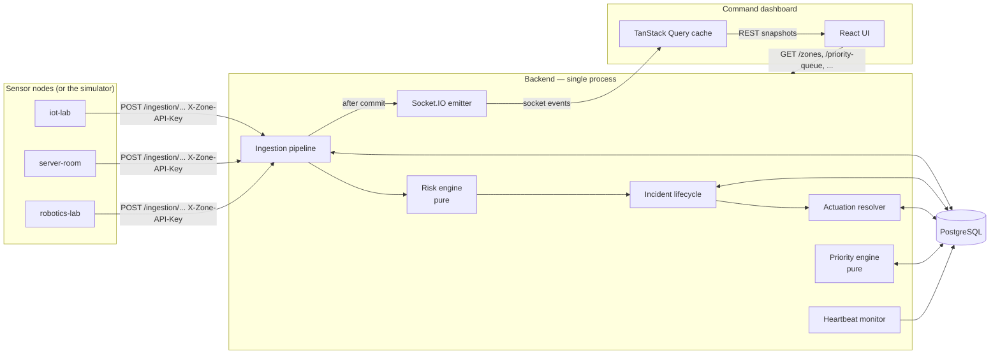

# Architecture

## The one rule everything else follows

A sensor node submits **raw readings only**. It never submits a risk score, a
state, a priority or an incident status — and if it tries, the request is
rejected with `400` rather than having the field quietly ignored. Every computed
value in the system is produced by the backend, from data the backend validated
itself.

That single rule is what makes the rest of the design fall out: if the node is
never trusted, the backend must own validation, debouncing, fusion,
classification, the incident lifecycle, ranking, actuation and the audit trail.

## Shape



## Packages

| Package                             | Responsibility                                                                                                                                                   |
| ----------------------------------- | ---------------------------------------------------------------------------------------------------------------------------------------------------------------- |
| `packages/shared` (`@scsrg/shared`) | The wire contract: domain enums, Zod schemas, `ApiResponse<T>`, the Socket.IO event map. Both apps typecheck against it, so a DTO cannot drift on one side only. |
| `backend`                           | Express 5 + Prisma + Socket.IO. The sole authority for every computed value.                                                                                     |
| `frontend`                          | React 19 + Vite + Tailwind 4 + shadcn/ui. A view over the backend; it computes no hazard state of its own.                                                       |

## Data flow for one reading

```mermaid
sequenceDiagram
  participant Node as Sensor node
  participant API as Ingestion API
  participant Risk as Risk engine
  participant DB as PostgreSQL
  participant Sock as Socket.IO
  participant UI as Dashboard

  Node->>API: POST reading (raw values only)
  API->>API: 1. Zone API key (bcrypt, cached 60s)
  API->>API: 2. Zod schema — wrong shape → 400
  API->>API: 3. Semantic checks — impossible value → 422
  API->>API: 5. Ordering — stale? store, do not apply
  API->>API: 6–7. Normalise, debounce, warm-up gate
  API->>Risk: 8. computeRisk(inputs, config)
  Risk-->>API: score, state, contributions, reasons

  rect rgb(30,40,55)
    note over API,DB: 9–14 — one transaction
    API->>DB: persist reading
    API->>DB: update live zone state
    API->>DB: state transition (only on change)
    API->>DB: incident open / refresh / resolve
    API->>DB: actuation commands (only on change)
  end

  API->>DB: recalculate priority queue
  API->>Sock: broadcast (after commit)
  Sock->>UI: zone:updated, incident:created, priority:updated
  UI->>API: refetch snapshots on (re)connect
```



Steps 9–14 are one transaction on purpose. A crash between "reading stored" and
"transition written" would leave the database asserting two different things
about the same moment; wrapping them means the alternative is that neither
happened. The broadcast sits deliberately _outside_ the transaction, so a
rolled-back write never announces itself and no socket write holds a row lock.

## Backend layering

```
routes → controller → service → repository → Prisma
                   ↘ pure engine (no I/O)
```

- **Controllers** parse, delegate and shape. No business rule lives in one.
- **Services** hold the rules and never import the Prisma client.
- **Repositories** are the only place Prisma appears; each accepts either the
  root client or an open transaction, so a service can compose several inside
  one atomic unit.
- **Engines** (`risk-engine`, `priority-engine`, `actuation.resolver`) are pure
  functions. No clock, no I/O, no database — time and configuration are passed
  in. That is what makes their tests deterministic and free of `sleep()`.

## In-memory state

Debounce counters, the gas warm-up window, occupancy debounce, water phase and
recovery counters live in per-zone maps. Every one of them is a **cache**, never
the only copy: each exposes `rehydrate()`, and the bootstrap sequence rebuilds
all of them from stored readings before the HTTP listener binds. Killing the
process loses nothing.

## Frontend state

TanStack Query owns all server data. Socket events **patch or invalidate** that
cache — they never write to a parallel store the UI reads instead. On connect
and every reconnect the dashboard refetches four snapshots
(`/dashboard/summary`, `/zones`, `/incidents?active=true`, `/priority-queue`),
so a client that missed events while disconnected converges on the truth rather
than showing a confidently stale picture.

De-duplication happens once, at a single socket reader, before events fan out to
subscribers. Doing it per subscriber looks equivalent and is not: the first hook
to register would consume the `eventId` and every other hook would silently miss
the event. The stacked-alert test in `command-center.test.tsx` exists because
that is exactly what happened.

## What this deliberately is not

- **No queue, cache or second process.** One backend process owns the HTTP
  server, the socket server, the heartbeat sweeper and the simulator engine. At
  multi-instance scale the in-memory caches and the heartbeat sweeper would need
  to move behind a shared store and a single leader.
- **No deployment automation.** Compose for local Postgres and a backend
  Dockerfile; production infrastructure is documented, not provisioned.
- **No hardware integration.** Actuation is a logged command model with a
  simulated actuator display.
