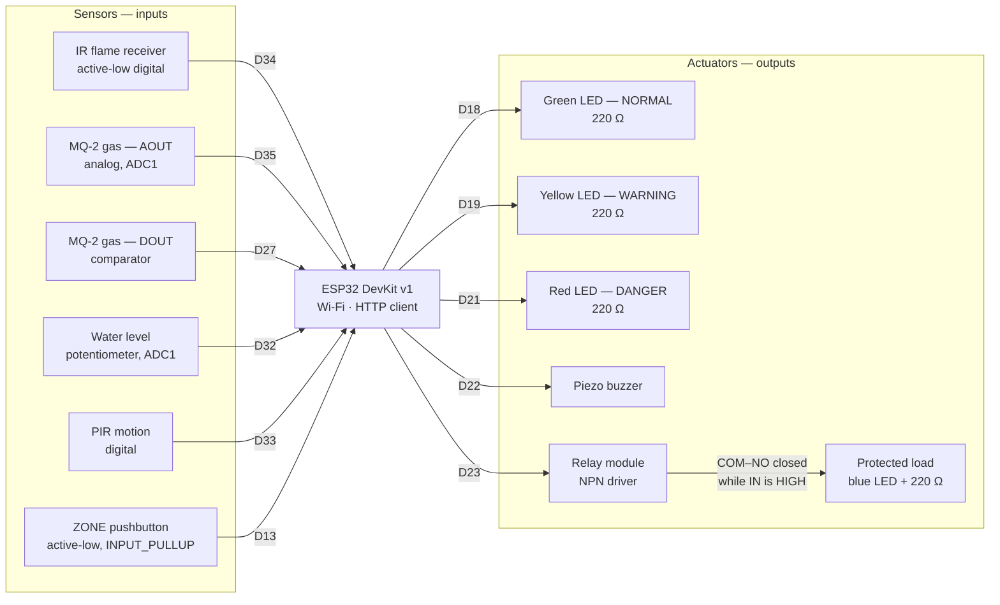

# Circuit Diagram

The hardware side of one zone node: an ESP32-WROOM-32 DevKit v1 sampling flame,
gas, water and occupancy, and driving three status LEDs, a buzzer and a power
cutoff relay. The board is the same whether it runs on real silicon or in Wokwi
— the simulated node speaks the identical HTTP API.

Machine-readable source of truth: [`firmware/diagram.json`](../firmware/diagram.json)
(the active board) and [`firmware/zones/<code>/diagram.json`](../firmware/zones)
(one per seeded zone). Pin constants are `PIN_*` in
[`firmware/include/app_config.h`](../firmware/include/app_config.h) — that header
and the diagrams are the two places a wiring change has to land together.

## Schematic



## Pin map

| Function              | GPIO     | Direction   | Rail | Notes                                                        |
| --------------------- | -------- | ----------- | ---- | ------------------------------------------------------------ |
| IR flame — `DAT`      | 34       | in          | 3V3  | Active-low; bursts latched for `IR_FLAME_HOLD_MS`            |
| MQ-2 gas — `AOUT`     | 35       | in (analog) | VIN  | ADC1; linearised to ppm, then normalised to 0..1 on the wire |
| MQ-2 gas — `DOUT`     | 27       | in          | VIN  | Comparator line; biased — see `GAS_DIGITAL_ACTIVE_LOW`       |
| Water level — `SIG`   | 32       | in (analog) | 3V3  | Potentiometer stands in for the float/probe in simulation    |
| PIR motion — `OUT`    | 33       | in          | 3V3  | Occupancy                                                    |
| ZONE select button    | 13       | in          | —    | To GND, `INPUT_PULLUP`; press = next room on the multi board |
| Status LEDs G / Y / R | 18/19/21 | out         | —    | 220 Ω series resistor each, cathodes to the GND rail         |
| Buzzer                | 22       | out         | —    | `tone()` on an LEDC channel                                  |
| Relay — `IN`          | 23       | out         | VIN  | **HIGH = powered, LOW = cut**                                |
| Serial console        | TX0/RX0  | —           | —    | 115200 baud; every rejection body is printed verbatim        |

Every analog channel sits on **ADC1**. ADC2 shares hardware with the Wi-Fi
radio, so an ADC2 read returns garbage the moment the radio is up — which for
this node is always.

The flame receiver, PIR and potentiometer run from **3V3**; the MQ-2 and the
relay module take **VIN** (5 V), because neither works reliably at 3.3 V. All
grounds are common: sensor grounds to `GND.2`, the output-side breadboard rail
to `GND.1`.

## The relay is wired to fail safe

```
ESP32 VIN ──▶ relay COM
                 ├── NO ──▶ 220 Ω ──▶ blue LED ──▶ GND     (protected load)
                 └── NC ──× not connected
GPIO 23   ──▶ relay IN
```

The load hangs off the **NO** terminal, not NC. The relay closes COM–NO while
`IN` is HIGH, and HIGH is what the firmware drives when the backend has _not_
ordered a cutoff — so the load is energised exactly when it should be. A dead,
unflashed or unpowered board leaves `IN` low, COM falls back to NC, and the load
stays de-energised.

Read the command naming carefully, because it is inverted against the pin:
`ACTIVATE_RELAY` carries `relayCutoff: true` and means _cut the power_, so it
drives `PIN_RELAY` **LOW**. `DEACTIVATE_RELAY` restores it. The firmware inverts
this explicitly and says so at the call site; `ActuatorState` in
[`actuation.resolver.ts`](../backend/src/modules/actuation/actuation.resolver.ts)
is the authority on which state wants which.

## Per-zone boards

One firmware, three boards. A zone carries only the sensors it has a row for in
the database — reporting a channel the zone lacks is a `422
SENSOR_NOT_CONFIGURED`, so the wiring and the seed data have to agree.

| Zone           | Populated channels                   | Omitted |
| -------------- | ------------------------------------ | ------- |
| `iot-lab`      | flame (34) · gas (35, 27) · PIR (33) | water   |
| `robotics-lab` | flame (34) · gas (35, 27) · PIR (33) | water   |
| `server-room`  | flame (34) · water (32) · PIR (33)   | gas     |
| `multi`        | all of the above + ZONE button (13)  | —       |

`pnpm firmware:config -- server-room --write` rewrites both
`include/zone_secrets.h` and the active `diagram.json`, so credentials and board
layout cannot drift apart. The outputs — three LEDs, buzzer, relay — are
identical on every variant.

## What the board is allowed to decide

Nothing that reaches the wire. The node converts device units to the normalised
0..1 contract on-device (the calibration constants live there), and sends raw
values only:

| Channel | Device units       | On the wire      | Conversion constant         |
| ------- | ------------------ | ---------------- | --------------------------- |
| Gas     | 200–10000 ppm      | `0..1`           | `GAS_REPORT_FULL_SCALE_PPM` |
| Water   | 0–100 %            | `0..1`           | —                           |
| Flame   | active-low digital | boolean          | `IR_FLAME_HOLD_MS` latch    |
| PIR     | digital, or stale  | boolean / `null` | `SENSOR_TIMEOUT_MS`         |

Fire debounce and the gas warm-up window are **backend** rules: the node reports
the raw line every publish interval and lets the backend decide when a flicker
becomes a fire. A PIR that has timed out reports `occupancyDetected: null`,
never `false` — the schema models an unavailable sensor as unknown, and `false`
would read as "nobody is in danger here".

The node does compute a local risk score, and it never transmits it. It exists
for one case: after `BACKEND_AUTHORITY_GRACE_MS` without a successful call, the
node stops obeying stale commands and its own state machine takes the pins back,
so a node that loses the network keeps alarming locally instead of going dark.
Keep that grace period above `ZONE_OFFLINE_TIMEOUT_MS` so the backend has
already marked the zone `OFFLINE` before the node stops listening.

## Bringing the board up

```bash
pnpm db:up && pnpm db:seed && pnpm dev   # backend must exist before the node does
pnpm firmware:config -- iot-lab --write  # writes zone UUID + API key + diagram
cd firmware && pio run                   # then start Wokwi, or: pio run -t upload -t monitor
```

Reaching a backend on your own machine from Wokwi needs the **Private IoT
Gateway** — that is what makes `host.wokwi.internal` resolve. Full build and
run instructions, including headless Wokwi CI, are in
[`firmware/README.md`](../firmware/README.md).
