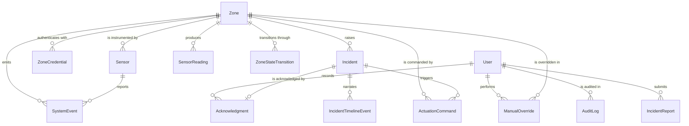

# Database schema

Normalised PostgreSQL 18, managed with Prisma migrations. Full definition:
[`backend/prisma/schema.prisma`](../backend/prisma/schema.prisma).

## Entity relationships



## Tables

| Model | Purpose | Load-bearing constraints |
|---|---|---|
| `User` | Dashboard accounts | `UNIQUE(email)`; `passwordHash` bcrypt cost 12 |
| `Zone` | Monitored area **and** its live projection | `UNIQUE(code)`; `assetImportance` 0–8; soft delete via `isActive` |
| `ZoneCredential` | Per-zone API key | `apiKeyHash` bcrypt; nullable `revokedAt`; index `(zoneId, revokedAt)` |
| `Sensor` | Per-zone sensor configuration | `UNIQUE(zoneId, type)`; `isCritical`; free-form `configuration` JSON |
| `SensorReading` | Immutable raw + computed record | `UNIQUE(readingId)`, `UNIQUE(zoneId, sequenceNumber)`, FK → Zone `onDelete: Restrict` |
| `ZoneStateTransition` | State-change audit | index `(zoneId, createdAt)` |
| `Incident` | Hazard event | **partial `UNIQUE(zoneId) WHERE status IN ('OPEN','ACKNOWLEDGED')`**; FK → Zone `onDelete: Restrict` |
| `Acknowledgment` | Who acknowledged, when | `UNIQUE(incidentId)` |
| `IncidentTimelineEvent` | Ordered narrative | index `(incidentId, createdAt)` |
| `ActuationCommand` | LED / buzzer / relay command log | indexes `(zoneId, requestedAt)`, `(status)` |
| `ManualOverride` | Admin action record | FKs → Zone, User |
| `AuditLog` | Security-relevant actions | indexes `(userId, createdAt)`, `(entityType, entityId)`, `(action)` |
| `SystemEvent` | Health / validation / offline events | indexes `(createdAt)`, `(type, severity)` |
| `IncidentReport` | Natural-language field report (bonus 3) | `status` PENDING / CONFIRMED / REJECTED |
| `ReadingHourlyAggregate` | Retention rollup | `UNIQUE(zoneId, hour)` |

## The two constraints Prisma's DSL cannot express

Both live in a hand-written migration,
[`20260724192500_partial_unique_indexes`](../backend/prisma/migrations/20260724192500_partial_unique_indexes/migration.sql).

### One active incident per zone

```sql
CREATE UNIQUE INDEX incident_one_active_per_zone
  ON "Incident" ("zoneId")
  WHERE "status" IN ('OPEN', 'ACKNOWLEDGED');
```

This *is* the no-duplicate-incident guarantee. A score oscillating around the
threshold, or two concurrent ingestion requests for the same zone, cannot create
a second active incident because Postgres refuses the insert. The application
catches the violation and treats it as "someone else already opened it" — it
never re-implements the rule.

`schema-constraints.test.ts` asserts the second insert fails, and that a new
incident *is* allowed once the previous one is `RESOLVED`.

### Partial index for the active set

```sql
CREATE INDEX incident_active_started_at
  ON "Incident" ("startedAt" DESC)
  WHERE "status" IN ('OPEN', 'ACKNOWLEDGED');
```

The priority queue and dashboard summary read the active set constantly. A
partial index over three rows beats a full index over 270.

## Referential integrity

`Incident.zoneId` and `SensorReading.zoneId` use `onDelete: Restrict`. A zone
with history **cannot** be deleted — `PATCH /admin/zones/:zoneId` with
`isActive: false` is the supported removal path, and the integration test
asserts the hard delete fails.

## The `isDuplicate` column

Two different things are easy to confuse here:

- An **exact duplicate** (same `readingId`, or same `(zoneId, sequenceNumber)`)
  is rejected at the unique constraint with `409` and logged as a
  `SystemEvent`. It never creates a second row, so it can never be counted
  twice.
- `isDuplicate = true` marks an **accepted** reading whose sensor payload was
  byte-identical to the immediately preceding accepted reading. It is a real
  signal — "nothing changed" — used to suppress redundant timeline noise.

## Performance gate

With 24 838 readings and 272 incidents seeded, the hot query — *all CRITICAL or
active incidents from the last 24 hours across all zones* — must complete in
under 50 ms using an index.

```text
$ pnpm db:explain

  Index used:     incident_active_started_at
  Execution time: 0.39 ms (budget 50 ms)

✓ Performance gate passed.
```

`scripts/explain-hot-queries.ts` runs `EXPLAIN (ANALYZE, BUFFERS)` and **exits
non-zero** on a sequential scan or a runtime over budget. Dropping the index
breaks the build; a gate that only prints is not a gate.

## Seed data

`pnpm db:seed` is idempotent and produces:

- Two development accounts (see the README — they are development-only).
- Three zones with their sensors, asset importance and one API credential each.
- ≥ 10 000 historical readings spread over seven days.
- Resolved incidents with complete timelines and actuation records.
- Exactly one acknowledged incident.
- Sample audit logs and system events.

Zone API keys are printed once and written to `backend/.dev-zone-keys.json` and
`backend/.env.simulator`, both gitignored. Re-running the seed rotates them —
the previous plaintext is unrecoverable, so leaving the old hash in place would
mean an unusable credential.
