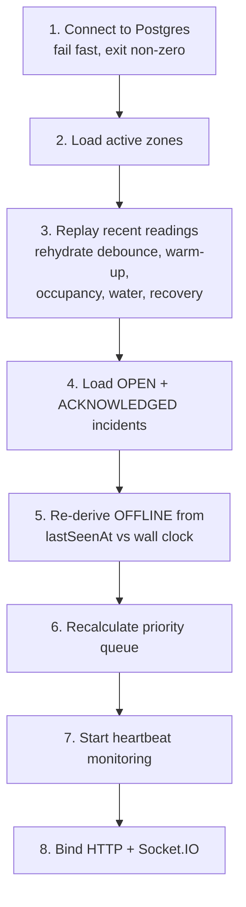

# Resilience

## Offline detection

Every zone has a heartbeat: either an accepted reading or an explicit
`POST /ingestion/zones/:zoneId/heartbeat`. A sweeper runs every
`ZONE_OFFLINE_SWEEP_MS` (2 000) and marks any active zone whose `lastSeenAt` is
older than `ZONE_OFFLINE_TIMEOUT_MS` (10 000) as `OFFLINE`.

What that does **and does not** do:

| Behaviour | Why |
|---|---|
| Records a `ZoneStateTransition` and a `SystemEvent` (`WARN`) | Going dark is an event worth auditing. |
| Keeps `lastSeenAt` visible in the UI | "How long has it been quiet?" is the operator's first question. |
| Leaves any active incident **open** | Losing contact is not evidence the hazard ended. |
| Leaves the buzzer and relay **untouched** | Silencing an alarm because a node stopped reporting is precisely backwards. |
| Changes the LED to a distinct amber pulse | Visually different from both `SAFE` and `WARNING`. |
| Never renders as `SAFE` | `OFFLINE` means *unknown*, and unknown is not safe. |

A zone whose **critical** sensor (flame, `isCritical: true`) reports unavailable
is marked `OFFLINE` even while its other sensors keep reporting — a blind fire
detector is not a safe room.

On reconnection the zone re-authenticates, its readings are accepted,
`lastSeenAt` updates, gas warm-up restarts, and state is recomputed from the
first accepted reading — never assumed `SAFE`. Any backlog the node replays goes
through the same duplicate and ordering rules as live traffic.

## Restart recovery

`bootstrap/` runs the full sequence **before** the HTTP listener binds, so the
first request a client makes already sees reconstructed state.



The backend never assumes zones are `SAFE` after a restart. A zone that went
quiet while the process was down comes back `OFFLINE`, because step 5 compares
its `lastSeenAt` against the wall clock rather than trusting the stored state.

Every in-memory cache is rebuildable and none is the only copy:

| Cache | Rebuilt from |
|---|---|
| Fire debounce counters | Last 40 accepted readings per zone |
| Occupancy debounce | Same window |
| Water phase | Last reading with a water level |
| Gas warm-up window | `Sensor.warmupStartedAt`, or restarted if unknown |
| Recovery counters | Risk scores of the replayed window |
| Actuator last-known state | `Zone.ledColor` / `buzzerActive` / `relayCutoffActive` |

Verified by an integration test that drives a zone to `CRITICAL`, drops every
in-memory map, runs the real reconstruction, and asserts zone states, open
incidents and priority-queue ordering are identical — and that a confirmed fire
is still confirmed afterwards.

## Concurrency safety

| Hazard | Guarantee |
|---|---|
| Two officers acknowledging at once | Conditional `UPDATE … WHERE status='OPEN'` + `UNIQUE(incidentId)`. Exactly one 200. |
| Oscillation creating duplicate incidents | Partial unique index `Incident(zoneId) WHERE status IN ('OPEN','ACKNOWLEDGED')`. The database refuses. |
| Duplicate readings | `UNIQUE(readingId)` and `UNIQUE(zoneId, sequenceNumber)`. Rejection rides the constraint, so it stays correct under concurrency where an application-level lookup would not. |
| A crash mid-pipeline | Steps 9–14 are one transaction. Either the reading, its transition, its incident and its commands all exist, or none do. |
| A rolled-back write announcing itself | Broadcasts happen strictly after commit. |

## Load behaviour

Measured on the development machine with `pnpm sim:load -- --zones 30 --hz 5`:

```text
submitted:   1320
accepted:    1320
rejected:    0
unaccounted: 0
throughput:  87.2 accepted readings/s over 15.1s
```

**Zero lost and zero duplicated accepted readings**, which is the criterion.
Throughput settles at ~87/s rather than the nominal 150/s because each simulated
node is self-paced: it waits for its own response before sending again, exactly
as a real device does. When the backend is the constraint, senders slow down
instead of queueing without bound. A fixed-rate sender would have shown a
higher submitted count and a pile of dropped sockets — a measurement of the
harness, not the system.

Two findings came out of that run and were fixed rather than tuned around:

1. **bcrypt on the hot path.** Verifying a bcrypt-hashed API key on every
   reading costs ~250 ms. At 150 readings/s that consumes every core and
   throughput collapsed below 1/s. bcrypt now gates the *first* presentation of
   a key; the result is cached for 60 s against a SHA-256 digest compared in
   constant time. Keys are still only stored as bcrypt hashes, and a rotation
   invalidates the cache immediately.
2. **Rate limiting keyed on IP.** Thirty nodes behind one address shared a
   single 1 200/min budget and throttled each other. Ingestion is now limited
   **per zone**, and is excluded from the 300/min dashboard API budget entirely.

### Scaling beyond one process

The prototype runs a single backend process that owns the HTTP server, the
socket server, the heartbeat sweeper and the simulator engine. What changes at
multi-instance scale:

| Concern | Now | At scale |
|---|---|---|
| Heartbeat sweeper | Runs in-process on a timer | One leader via a Postgres advisory lock, or a dedicated worker. Two instances sweeping concurrently would each try to write the same transition — the transaction makes that safe but wasteful. |
| Socket fan-out | In-process emitter | A Redis (or Postgres `LISTEN/NOTIFY`) adapter so every instance reaches every client. |
| Debounce / warm-up caches | Per-process maps | Already rebuildable from Postgres; at scale either pin a zone to an instance or move the counters into the reading query itself. |
| Verified-key cache | Per-process, 60 s TTL | Unchanged — a per-instance cache is correct, it simply warms independently. |
| Connection pool | `DATABASE_POOL_SIZE` (25) | A pooler (PgBouncer) in transaction mode, since each reading is a short transaction. |

None of that is built. It is written down because the honest answer to "does
this scale?" is "here is exactly what would have to change", not a hand-wave.
